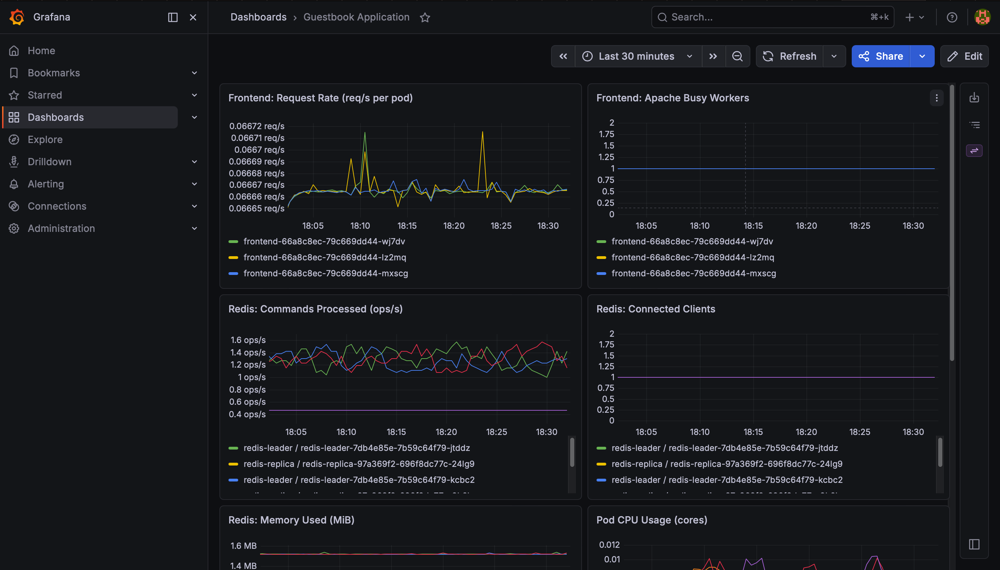

# Kubernetes Guestbook with Prometheus & Grafana Monitoring

Pulumi · Python · Kubernetes · Prometheus Operator · Grafana

This project takes the standard Pulumi Kubernetes Guestbook app and adds a working monitoring stack on top of it. Deploy it, and you get the guestbook (frontend + Redis) plus Prometheus collecting metrics and a Grafana dashboard to view them.

It uses the Prometheus Operator, so scrape targets are defined with `ServiceMonitor` resources instead of hand edited Prometheus config. Each guestbook pod runs an exporter sidecar that exposes its metrics, and the Grafana dashboard ships as a `ConfigMap` so it stays in version control alongside the rest of the infrastructure code.

Upstream reference: [Pulumi Kubernetes Guestbook](https://github.com/pulumi/examples/blob/master/kubernetes-ts-guestbook)

---

## Architecture & Flow

Prometheus scrapes metrics from the exporter sidecars on the guestbook pods and from the cluster itself. Grafana queries Prometheus and renders the dashboards a user actually looks at.

```text
┌─────────┐
│  User   │
└────┬────┘
     │ Views Dashboards
     ▼
┌──────────────┐         ┌─────────────────────────┐
│              │ Queries │                         │
│   Grafana    │ ◄────── │       Prometheus        │
│ (Visuals &   │         │ (Central Data Storage)  │
│  Dashboards) │         │                         │
└──────────────┘         └──────────┬──────────────┘
                                    │ Pulls Metrics
                                    ▼
════════════════════════════════════════════════════════════
  KUBERNETES CLUSTER
     [ Application Layer ]
     ┌────────────────────┐      ┌────────────────────┐
     │   Frontend Apps    │      │  Redis Databases   │
     │  (Web interface)   │      │ (Data & Caching)   │
     └────────────────────┘      └────────────────────┘
     [ Infrastructure Layer ]
     ┌────────────────────────────────────────────────┐
     │   Kubernetes Health (Nodes, Pods, Memory)      │
     └────────────────────────────────────────────────┘
════════════════════════════════════════════════════════════
```

**Components deployed by Pulumi**

| Component | Namespace | Purpose |
|---|---|---|
| `frontend` Deployment + Service | `default` | PHP/Apache web app, with an `apache-exporter` sidecar on port 9117. |
| `redis-leader` Deployment + Service | `default` | Redis write store, with a `redis_exporter` sidecar on port 9121. |
| `redis-replica` Deployment + Service | `default` | Redis read replicas, with a `redis_exporter` sidecar on port 9121. |
| `kube-prometheus-stack` (Helm) | `monitoring` | Prometheus, Grafana, Alertmanager, kube-state-metrics, node-exporter. |
| 3 `ServiceMonitor` CRs | `monitoring` | Tell the Prometheus Operator what to scrape. |
| `guestbook-dashboard` ConfigMap | `monitoring` | Grafana dashboard, auto loaded by the dashboard sidecar. |

---

## What Gets Monitored



The provisioned **Guestbook Application** dashboard has eight panels:

* **Frontend request rate** (`rate(apache_accesses_total[2m])`).
* **Error rate proxy** via container restarts (`rate(kube_pod_container_status_restarts_total[5m])`).
* **Redis commands per second** (`rate(redis_commands_processed_total[2m])`).
* **Redis connected clients** (`redis_connected_clients`).
* **Redis memory used** in MiB (`redis_memory_used_bytes`).
* **Pod CPU usage in cores** from cAdvisor.
* **Pod memory working set in MiB** from cAdvisor.
* **Targets UP** for all three scrape jobs (`up{job=~"frontend|redis-leader|redis-replica"}`).

Plus everything that ships with `kube-prometheus-stack` out of the box: node level metrics, kube-state-metrics, Alertmanager.

---

## Prerequisites

* A Kubernetes cluster reachable via `kubectl` (Docker Desktop with Kubernetes enabled is the default target here).
* [Pulumi CLI](https://www.pulumi.com/docs/install/) installed.
* Python 3.9 or newer.
* `kubectl` configured against the target cluster (`kubectl config current-context`).

---

## Deploy the Application

```bash
# 1. Clone the repo and enter the project.
git clone <your-repo-url>
cd pulumi-k8s-guestbook-monitoring

# 2. Create a virtualenv and install Python dependencies.
python3 -m venv venv
source venv/bin/activate
pip install -r requirements.txt

# 3. Pick a Pulumi backend.
pulumi login              # cloud backend
# OR: pulumi login --local

# 4. Initialise the stack.
pulumi stack init dev

# 5. Set the Grafana admin password as an encrypted Pulumi secret.
pulumi config set --secret grafanaAdminPassword <choose-a-password>
# Optional: override the username (defaults to "admin").
# pulumi config set grafanaAdminUser admin

# 6. Preview, then deploy.
pulumi preview
pulumi up --yes
```

`pulumi up` provisions the guestbook, the monitoring stack, the `ServiceMonitor`s, and the Grafana dashboard `ConfigMap`. First deploy takes roughly 2 minutes. Wait for every pod to reach `Running`:

```bash
kubectl get pods -A -w
```

When it finishes, Pulumi prints the access details:

```
Outputs:
    frontend_ip            : "10.x.x.x"
    grafana_admin_password : [secret]
    grafana_admin_user     : "admin"
    grafana_dashboard      : "Guestbook Application (auto-loaded via sidecar)"
    grafana_url            : "http://localhost:31000"
```

---

## Access Grafana

Grafana is exposed as a `NodePort` service on port **31000**. On Docker Desktop, `localhost:31000` routes directly to the cluster node.

**URL**: `http://localhost:31000`

**Credentials**

* Username: `admin` (or whatever you set for `grafanaAdminUser`).
* Password: the value you set with `pulumi config set --secret grafanaAdminPassword`.

Retrieve the password without printing it into a file:

```bash
# From the Pulumi stack output (decrypts the secret).
pulumi stack output grafana_admin_password --show-secrets

# Or from the in cluster Secret that Grafana actually reads.
kubectl get secret -n monitoring kps-grafana -o jsonpath="{.data.admin-password}" | base64 --decode
```

After logging in, open **Dashboards, Browse, Guestbook Application**.

---

## Verify Prometheus Is Scraping Guestbook Metrics

Confirm the `ServiceMonitor`s exist:

```bash
kubectl get servicemonitor -n monitoring | grep -E 'frontend|redis'
# Expected:
#   frontend          ...
#   redis-leader      ...
#   redis-replica     ...
```

Open the Prometheus UI to check live targets:

```bash
kubectl port-forward -n monitoring svc/kps-kube-prometheus-stack-prometheus 9090:9090
```

At `http://localhost:9090`:

1. **Status, Target health** lists every scrape target. The three pools `serviceMonitor/monitoring/frontend`, `redis-leader`, and `redis-replica` should be `UP`. If a target is missing, the `ServiceMonitor` label selector is not matching the Service labels.
2. **Graph** tab: confirm data flow with these queries:
   * `rate(apache_accesses_total{job="frontend"}[2m])`
   * `redis_up`
   * `rate(redis_commands_processed_total{job=~"redis-.*"}[2m])`
   * `container_memory_working_set_bytes{namespace="default",pod=~"frontend-.*|redis-.*"}`

Command line equivalent:

```bash
# Guestbook targets should report health "up"
curl -s http://localhost:9090/api/v1/targets | grep -Eo '"scrapePool":"serviceMonitor/monitoring/(frontend|redis-leader|redis-replica)[^"]*","scrapeUrl[^,]+,"globalUrl[^,]+,"lastError":"[^"]*","lastScrape[^,]+,"lastScrapeDuration[^,]+,"health":"[^"]+"'
```

---

## Configuration

Set with `pulumi config set [--secret] <key> <value>`:

| Key | Type | Default | Purpose |
|---|---|---|---|
| `grafanaAdminPassword` | secret (required) | none | Grafana login password. Encrypted in `Pulumi.<stack>.yaml`. |
| `grafanaAdminUser` | plain (optional) | `admin` | Grafana login username. |
| `useLoadBalancer` | bool (optional) | `false` | Expose the frontend Service as LoadBalancer instead of ClusterIP. |

Constants in `__main__.py` (edit the source to change):

| Constant | Default | Purpose |
|---|---|---|
| `GRAFANA_NODE_PORT` | `31000` | NodePort for the Grafana Service. |

---

## Implementation Notes

* **Docker Desktop quirk.** `node-exporter`'s rootfs mount is disabled (`hostRootFsMount.enabled: false`) because Docker Desktop's `/` is not a shared mount, which otherwise crash loops the DaemonSet pod. The remaining node-exporter metrics (CPU, memory, network) still work.
* **No `/metrics` on base images.** The raw `redis` and `pulumi/guestbook-php-redis` images do not expose Prometheus metrics. Sidecars (`oliver006/redis_exporter`, `lusotycoon/apache-exporter`) translate native status output into Prometheus format.
* **ServiceMonitor versus annotations.** `kube-prometheus-stack` uses the Prometheus Operator. The operator watches `ServiceMonitor` CRDs and generates scrape config; pod or service `prometheus.io/scrape` annotations are ignored unless an `additionalScrapeConfigs` job that honors them is added.
* **Apache error rate.** `apache-exporter` does not expose per HTTP status code counters because mod_status `?auto` does not return them. The dashboard's "Error Rate" panel approximates errors via container restart rate. A production setup would either ship native `/metrics` from the app (OpenTelemetry or the Prometheus PHP client) or use blackbox-exporter probes for per status code observation.

---

## Production Hardening Roadmap

This stack is the minimum viable deploy. Below is what I would add before shipping to real users, condensed to one row per concern.

| Area | Today | Production target |
|---|---|---|
| Prometheus storage | `emptyDir`; lost on restart. | PVC on fast SSD, 15 to 30 day retention. Long term: Thanos or Mimir to S3 with downsampling. |
| Grafana storage | SQLite in `emptyDir`. | Managed Postgres or MySQL (RDS, Cloud SQL); enables HA and survives pod restarts. |
| Alertmanager storage | `emptyDir`. | PVC plus 3 replica gossip cluster so silences and history survive failover. |
| Pulumi state | Local or personal account. | Pulumi Cloud or S3/GCS backend with state locking, per env stacks, Pulumi ESC for secrets. |
| High availability | Single replicas everywhere. | Prometheus replicas: 2, Alertmanager 3 replica HA, Grafana 2+ replicas with shared DB, PDBs, topology spread across AZs. |
| Resource sizing | Defaults from chart. | Right size `requests` (Prometheus often needs 4+ GiB). Avoid `limits` on Prometheus; OOM during compaction. |
| Secrets | Pulumi config `--secret` (encrypted in state). | External Secrets Operator backed by AWS Secrets Manager, Vault, or SOPS in git. Rotate on schedule; remove the bootstrap value from Pulumi config. |
| AuthN | Local Grafana admin. | OIDC or SAML (Okta, Google, Azure AD). Local admin disabled; emergency account in vault. |
| AuthZ | None. | Grafana RBAC and folder permissions per team. Prometheus stays cluster internal. |
| Network policy | Open. | Deny all default in `monitoring` and `default`; explicit allows for Prom to exporters, Graf to Prom, AM egress. |
| Pod security | Defaults. | `runAsNonRoot`, `readOnlyRootFilesystem`, drop caps, `seccompProfile: RuntimeDefault`; enforced by PSA `restricted` or Kyverno. |
| Supply chain | `:tag` images, unsigned. | Digest pinned images, scanned with Trivy or Snyk, signed with cosign, SBOMs via Syft. |
| Inter component TLS | Plain HTTP. | mTLS via cert-manager and `tlsConfig` on ServiceMonitors. |
| Exposure | NodePort. | Ingress (nginx or Traefik), TLS via cert-manager + Let's Encrypt, OAuth2 Proxy or WAF in front. Prom and AM internal only. |
| Logging | None in this stack. | Loki and Promtail (or Vector or Fluent Bit), JSON structured logs, S3 backed retention, Loki as a second Grafana datasource. |
| Tracing | None. | OpenTelemetry Collector, Tempo or Jaeger backend, app side OTel SDKs, Prometheus exemplars wired to traces. |
| Alerting | Default routes only. | PagerDuty or Opsgenie routes by severity, SLO multi burn rate alerts, recording rules, `runbook_url` on every alert. |
| App metrics | `apache_accesses_total` only. | Native `/metrics` via Prometheus PHP client (RED method, histograms); blackbox-exporter Probes for synthetic checks. |
| Redis topology | 3 independent leaders. | Sentinel or Cluster mode, AOF persistence, or migrate to ElastiCache or MemoryStore. |
| Autoscaling | Static replicas. | HPA on frontend via prometheus-adapter custom metrics, VPA recommendations on monitoring stack, Cluster Autoscaler or Karpenter. |
| Cardinality | Unbounded. | Drop high cardinality labels via `metric_relabel_configs`. Cardinality is the #1 cause of Prometheus OOMs. |
| CI/CD | Manual `pulumi up`. | GitOps (Argo CD or Flux), policy as code (CrossGuard or OPA), per PR ephemeral stacks, per env config. |
| Backup and DR | None. | Velero cluster snapshots, Thanos for Prometheus durability, RDS snapshots for Grafana DB, documented DR runbook with RPO/RTO, quarterly game days. |
| Multi cluster | Single cluster. | Thanos Receive or Mimir centralised, single global Grafana with per cluster datasource variables, optional Cilium or Istio mesh. |
| Cost controls | None. | Resource tags (`team`, `env`, `cost-center`), Kubecost for visibility, spot nodes for stateless tiers, tiered metric retention. |
| Audit and compliance | None. | K8s API audit logs and Grafana audit logs shipped to a SIEM (Splunk, Datadog, ELK). |

Day one priorities if I were taking this to production: (1) Prometheus on a PVC with proper retention, (2) move secrets from Pulumi config to External Secrets backed by a real vault, (3) Grafana behind Ingress with TLS and OIDC. Everything else is incremental.

---

## Tear Down

```bash
pulumi destroy --yes
pulumi stack rm dev --yes
```

Manual cleanup of a stuck Helm release (rare, only if `pulumi destroy` fails partway):

```bash
kubectl delete secret -n monitoring -l owner=helm
kubectl delete ns monitoring
```

---

## Project Layout

```text
.
├── __main__.py          # Pulumi program entry point (all resources defined here)
├── Pulumi.yaml          # Project metadata
├── requirements.txt     # Python dependencies (pulumi, pulumi-kubernetes)
├── README.md            # This file
├── docs/
│   └── grafana-dashboard.png
└── .gitignore
```
